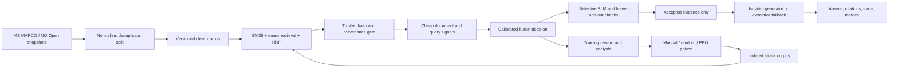

# Sentinel RAG: full build plan

Prepared 2026-09-25 from all 38 pages of `Presentation.pdf`, the existing repository, and a baseline test run. `PROJECT_MEMORY.md` is the short durable context file. This is a plan, not a claim that the full system is implemented.

## Progress checkpoint (2026-09-25)

P0 and P1 are implemented, including the isolated offline rebuild and frozen MS MARCO/NQ-Open benchmark. P2-P5 have working retrieval, attack staging, integrity, local Qwen 0.5B response generation, trained cheap-signal detection, and paired experiments. The slide-7 SRQ is now model-run on 50 train-clean calibration and all 75 validation queries per family; it performed poorly (0% greedy and 5.3% stealth recall with 6.7% clean FPR) and is not a serving gate. The local Qwen cited-answer path was also model-run on ten clean validation questions: raw answer text often matched a known alias, but no output supplied a valid citation under the original prompt. The strict validator now rejects marker-only responses, and extractive answering remains the default. Contriever/FAISS and broad answer-utility improvements remain open. A cached MiniLM comparison and train-only sentence ranker experiment are measured. P6-P8 have a bounded edit MDP, inspectable edit cache, terminal reward, masked factored PPO, and CPU training/evaluation paths. The single-seed undefended PPO ties fixed insertion (67/75 validation successes); defender-aware PPO ties fixed answer substitution (11/75 defended successes). No PPO advantage is claimed. P9 has a read-only validation view and trusted-ingest CLI but is incomplete. P10 now has a primary-source bibliography audit, presentation-ready references, a sealed first 75-query test run, and a reviewed figure. In that test, greedy attack success fell from 37/75 to 0/75 under defense, whereas stealth success changed from 23/75 to 22/75. P10 remains open for full slide corrections, broader attack families, and reproducibility packaging. Measured detail and limitations are in `PROJECT_MEMORY.md`, `REPORT_EVIDENCE.md`, `TEST_PROTOCOL_V1.md`, `LITERATURE_AUDIT.md`, and `README.md`.

2026-09-26 continuation: the v1 stealth failure audit shows accepted-ingest
hash parity on every successful altered source and no exact second document
for any nonabstaining clean selected answer. A new disjoint 140/30/30
two-passage benchmark v2 is frozen for development and a later test.
The first paired sentence-cosine gate failed its utility/security criterion
on validation and remains experimental. See `V2_BENCHMARK_PROTOCOL.md`.

## Remaining product work (2026-09-27 decision)

The live validation workbench now exposes a unified audit trace, exact source
spans, leave-one-out answer changes, and stage timing. A verified local-model
router with an extractive fallback exists but has not passed answer-quality
evaluation. An offline source-phrase repair replay improved Qwen alias matches
from 1/20 to 3/20, still below the MiniLM sentence ranker's 9/20 on the same
clean questions; it remains outside serving. Defender-aware PPO has three
seed-matched validation runs and does not beat fixed substitution (31/225
versus 34/225); further reward and architecture ablations are still open.
Matched random
edits scored 6/225 defended successes. Removing detector-risk step shaping
lowered PPO defended successes from 31/225 to 11/225 across the three seeds.
Removing the auxiliary proxy-value critic loss changed no deterministic
validation outcomes across those 225 seed-question pairs. An optional
nearest-neighbor edit-effect cache was integrated as a training reward signal
and tested on the same three seeds; it also changed zero deterministic
validation outcomes. Neither component showed an advantage in this setup.
An exploratory v2 peer-answer failover also failed to establish a safe
subtle-poison defense: a 0.60 post-hoc threshold removed two original wrong
answers but created two new ones by choosing poisoned peers. It stays out of
serving; genuinely independent source attestation remains necessary.
Removing chosen-action inputs to the position and payload heads also changed
zero deterministic outcomes in the same three-seed comparison; the legal
action masks remained active.
Three overt answer-layout development probes were also run on the same 75
validation questions: 225/225 altered documents were quarantined, with zero
defended wrong-answer successes. This does not establish robustness to novel
source families or subtle accepted-ingest replacements.
A signed, operator-reviewed source-origin map and
optional exact-span two-origin abstention policy now provide a high-assurance
contract for future corpora with genuinely independent sources. The current
benchmark cannot evaluate that policy, so it is not a measured or deployed
stealth defense. These additions do not justify promoting the failed v2 pair
gates. The sealed v1 test remains historical and the v2 test remains untouched.
`python scripts/verify_release.py` now verifies the current research artifacts,
tests, saved PPO comparison, and an isolated demo rebuild in one command.

The benchmark, attack harness, integrity workflow, detector, PPO prototype,
sealed v1 evidence, and live validation workbench exist. These priorities are
the remaining path to the complete system described by the presentation:

| Priority | Work and acceptance condition |
|---|---|
| 1. Subtle poisoning defense | Build answer-level corroboration or trusted-source provenance for accepted-ingest factual replacements. Select on v2 train/validation only. Advance only if attack success falls without unacceptable clean-answer loss; the tried pair-similarity gates failed this condition. |
| 2. Cited answer generation | Improve local generator answer quality, source-span citations, and abstention. Validate on clean and attacked development cases before enabling model generation in serving. Keep the extractive backend as the stable fallback. |
| 3. Integrated research serving | Connect versioned retrieval, integrity/provenance, calibrated signals, selective checks, generation, citation validation, and audit events. Expose the genuine model/backend and timing for every candidate. The deployed lab currently runs the hashing/extractive validation profile; MiniLM, Qwen, and PPO results are offline artifacts. |
| 4. PPO evidence | Three defender-aware seeds now have matched fixed substitutions and random edits. PPO beats random edits but not fixed substitution. Detector-risk, auxiliary critic, optional edit-effect cache, and action-head conditioning ablations are measured. Add undefended multi-seed runs and remaining reward/architecture ablations. |
| 5. Retrieval and robustness | FAISS FlatIP versus NumPy is measured on 425 development vectors and 10,200 synthetic perturbed replicas. Pinned Contriever-msmarco matches MiniLM's 73/75 and 74/75 RRF support recall on 75 validation passages, with higher observed CPU query latency, so the small serving profile remains MiniLM/NumPy where available. Three overt answer-layout probes were caught on development validation. Evaluate subtle new attack families, poison budgets, alternate generators, and genuinely distinct source origins. Freeze a new held-out protocol before testing an improved defense; v1 test is spent and v2 test is untouched. |
| 6. Reproducible release | Package CPU and GPU reproduction commands, raw examples, confidence intervals, resource costs, bibliography corrections, and a corrected presentation export. Every final claim must point to a measured artifact. |

Presentation-specific choices require explicit resolution: the implemented PPO
state is 774-dimensional rather than the unexplained 1,556-dimensional slide
target, and the measured local generator is Qwen 0.5B rather than a validated
Llama-3-8B NF4 run. Implement and evaluate those exact choices if required, or
correct the final slides. Model-backed SRQ and hidden-state/attention probes
were measured but performed poorly; their negative results are evidence, not
unimplemented live gates.

Frontend decision for the current pass: retain all research and demo behavior
while replacing the entire dark, ornamental interface with a plain-white,
flat-color, restrained research application. Use consistent type, form controls,
spacing, and accessible contrast across Research Lab, Five-Case Demo,
Architecture, and the saved-metrics archive.

2026-09-26 cited-generation checkpoint: exact source-span validation and
deterministic citation repair are implemented. A pinned 20-question Qwen
validation diagnostic produced 5/20 span-grounded citations but only 1/20
benchmark alias matches; keep this generator offline. Next, improve answer
selection and evidence-span citations on development data, then compare clean
utility and attack success before any serving promotion. The v2 test remains
untouched and the failed paired defense gates remain outside serving.

## 1. Definition of done

The project is complete when a reproducible run can: (1) build a licensed and traceable clean corpus and question set; (2) create hand-authored, random-edit, and PPO-generated poisoning attempts in an isolated local corpus; (3) show whether each attempt was retrieved and changed the answer; (4) detect and quarantine suspect documents using integrity, statistical, semantic, and counterfactual signals; (5) produce a cited answer or abstention using only accepted evidence; (6) report security, answer utility, and latency on held-out cases; and (7) reproduce the main results, figures, and live demo from documented commands.

The Review-1 demo remains a separate, lightweight profile. The full research profile adds training and larger experiments; it must not make the demo depend on an 8B model or a remote service.

## 2. Slide-to-build traceability

| Slides | Commitment | Planned proof |
|---|---|---|
| 1-5 | Problem, attack and defense objectives | Threat model, baseline attack, explicit success criteria |
| 6 | Hash verification and N+1 leave-one-out | Protected manifest, mismatch quarantine, ablation trace and cost |
| 7 | SLM Semantic Regurgitation Quotient | Versioned SRQ definition, small-model implementation, benign overlap controls |
| 8 | SDGs | Short impact discussion in report; no engineering claim |
| 9-14, 35-37 | Literature survey | Verified bibliography and comparison matrix, checked paper titles/IDs/claims |
| 16-18 | MS MARCO + NQ-Open | Dataset build scripts, provenance, quality checks and frozen splits |
| 19, 21, 23-27 | MDP, factored action policy, edit cache, reward, PPO | Trainable environment, checkpoints, learning curves, attack samples, ablations |
| 20, 22, 28-30 | Multi-stage secure RAG | Signal registry, calibrated fusion, filtering, generation, API and UI trace |
| 31-34 | Models, retrieval, storage and compute | Configured backends, benchmarked resource use, reproducible run profiles |
| 38 | Final demo | Scripted demonstration and evidence package |

## 3. Threat model and experimental contract

- **Attacker control:** The attacker can submit or edit a limited number of corpus documents before retrieval. A separate experiment may simulate a manipulated retriever ranking. The attacker cannot edit trusted system instructions, the protected manifest, evaluation labels, or defender weights during the final test.
- **Goals:** Cause a wrong factual answer, cause the assistant to follow an instruction in retrieved content, insert an untrusted URL, or cause refusal. Record each goal separately; never collapse them into one vague success flag.
- **Defender view:** The retriever sees a mixture of clean and candidate documents. The defender has only the user query, retrieved documents, trusted ingest metadata, and frozen detector components. Ground truth and attack labels are evaluation-only.
- **Research boundary:** All attack actions run against the local benchmark or a self-owned demo endpoint. Generated attack documents and reward queries stay in that environment.
- **Unit of analysis:** `(query_id, seed_doc_id, attack_id, corpus_version, defender_version)`. Every answer stores source IDs and the exact evidence span, including when the output is an abstention.
- **Success condition:** An attack succeeds only when it is valid, enters the top-k, and causes the measured attacker goal under the same generator/settings used by the clean baseline. Report unconditional success and success conditional on retrieval.

## 4. Target architecture

The attacker-training loop reads frozen defender versions. The live serving path never trains a policy or updates detector weights. A versioned artifact manifest ties corpus, embeddings, retriever, detector, thresholds, generator, and policy together.

## 5. Implementation phases

### P0. Stabilize and record the Review-1 baseline

**Work:** Reconcile the current uncommitted `config.py` changes without discarding them: restore or replace `QUERIES_PATH` and `RESULTS_DIR` contracts; split runtime and research config if those directories were intentionally removed from deployment. Ensure `data.build_queries` and `detect.train_fusion_classifier` import. Pin a reproducible Python environment. Add a small command such as `python scripts/doctor.py` to print dataset counts, backend, artifact compatibility, and missing dependencies. Capture the current 4 passing tests and 30-document demo behavior.

**Files:** `config.py`, `data/build_queries.py`, `detect/train_fusion_classifier.py`, `requirements*.txt`, `scripts/doctor.py`, `README.md`.

**Done when:** Fresh local setup, builder imports, classifier training, API startup, and existing tests pass without relying on stale artifacts. Existing demo outputs still work. No user changes are silently reverted.

### P1. Data and benchmark foundation

**Work:** Build frozen, provenance-tagged snapshots from the specified MS MARCO v1.1 passages and NQ-Open questions. Store dataset name, config, split, revision, extraction code version, license pointer, seed, and checksum. Normalize text, deduplicate near duplicates, exclude empty/oversized passages, and identify answerable query/corpus pairs. NQ-Open questions are not automatically answerable from a small MS MARCO sample, so validate answer support or build a linked clean-evidence subset before measuring answer quality. Keep the five existing demo cases as a `demo` split; create disjoint `train`, `validation`, and `test` sets grouped by query and source document. Freeze the test set before tuning attacks or detector thresholds.

**Suggested files:** `data/schema.py`, `data/build_corpus.py`, `data/build_queries.py`, `data/build_benchmark.py`, `data/splits/*.jsonl`, `artifacts/dataset_manifest.json`.

**Done when:** One command rebuilds identical IDs and hashes from a fixed snapshot; duplicate/leakage checks pass; each evaluation question has documented evidence and answer aliases; demo and held-out sets are disjoint.

### P2. Retrieval, trusted ingest, and attack harness

**Work:** Preserve BM25 + dense + RRF, but make embedding backend and model revision explicit. Add the slide-specified Contriever retriever as a research backend, keep MiniLM as a lightweight embedding/proxy backend, and compare both on the same retrieval cases. Add a search backend interface: exact NumPy for the small profile; normalized-vector FAISS inner-product search only if scale measurements justify it. Benchmark recall@k and build/query time before changing the backend. Separate `ingest_trusted_document` from `stage_untrusted_document`; make a trusted, versioned hash manifest external to the writable corpus and verify document bytes and metadata before evidence admission. New or missing-manifest documents default to untrusted until explicitly approved. Quarantine mismatches before any answer generation, with reason codes. Simulate honest edits, malicious edits, inserted documents, and compromised-rank behavior as distinct attack cases.

**Suggested files:** `retrieval/backends.py`, `retrieval/hybrid_retriever.py`, `security/manifest.py`, `security/ingest.py`, `attack/harness.py`.

**Done when:** A modified, inserted, or missing-manifest document cannot become accepted evidence through the integrity route; the exact and FAISS backends agree on a fixture; retrieval ranks and corpus versions are logged. State clearly that SHA-256 detects deviation from a trusted manifest and cannot establish a new document's truth.

### P3. Answer and attack baselines

**Work:** Define one common generator interface: deterministic extractive answerer for CPU demo, small local model for routine experiments, and the slide-specified Llama-3-8B 4-bit NF4 configuration for GPU experiments if the actual runtime and model access support it. Record a measured smaller-model fallback. Use actual role-separated messages and clearly marked document boundaries for LLM calls; keep document text as data, and validate citations against accepted source spans. The presentation says `AST + masking` but gives no AST schema, so define and test structured message construction plus masking of untrusted instructions before calling it implemented. Add explicit abstention when relevant accepted evidence is absent. Create attack baselines: current five authored cases, random valid edits, greedy retrieval-optimized edits, and simple query-matching poison. Keep attack budget, corpus and generator identical across comparisons.

**Suggested files:** `generation/base.py`, `generation/extractive.py`, `generation/local_llm.py`, `generation/citations.py`, `attack/baselines.py`.

**Done when:** Identical candidate sets can be run defense ON/OFF; each output includes evidence IDs; clean answer quality and attack success are measured before RL. Prompt isolation gets adversarial regression cases instead of being assumed sufficient.

### P4. Multi-signal detection

**Work:** Define and version each signal precisely. Keep current embedding Mahalanobis and Isolation Forest as cheap document-level signals. Add query relevance, instruction/URL patterns, authority claims, and contradiction/answer disagreement features. Implement the presentation's SLM SRQ with a small model response to `(query, document)` and a bounded, normalized semantic overlap score. Benchmark clean highly relevant passages so legitimate quotation is not treated as poison. If a model exposes hidden states and attentions, add a separately named layer-activation Mahalanobis probe and attention-concentration probe; otherwise label the embedding/sentence-level versions as proxies. The slide's S1/S2/S3/S4 naming is inconsistent across diagrams, so publish one stable signal dictionary with exact definitions. Fit covariance and Isolation Forest only within the training portion of each evaluation fold.

**Suggested files:** `detect/signals.py`, `detect/slm_srq.py`, `detect/model_probes.py`, `detect/feature_schema.py`, `detect/train_fusion_classifier.py`, `detect/calibration.py`.

**Done when:** Each signal has unit tests for clean, overt, and stealth cases; signal computation is deterministic at a fixed model revision; held-out plots show its detection and false-positive behavior. The UI states whether a signal is a real model probe or a proxy.

### P5. Fusion, thresholds, and selective counterfactual checks

**Work:** Train a calibrated fusion classifier on disjoint attack and clean examples, with a fixed feature schema and versioned scaler. Compare logistic regression to a simple non-parametric baseline; use the simpler model unless held-out evidence favors complexity. Choose decision thresholds from validation data for a stated false-positive budget; `sigmoid^-1(0.05)` is a probability logit, not a 5% false-positive-rate threshold. Run cheap checks for all retrieved candidates, then trigger expensive SLM/leave-one-out checks only for ambiguous or high-impact cases. Define LOO on the same generator and evidence set, compare answer content and source attribution, and record N+1 model-call cost. Avoid automatically marking every influential clean document malicious; influence must combine with suspicious content/contradiction signals.

**Suggested files:** `detect/detector.py`, `detect/ablation.py`, `detect/thresholds.py`, `results/calibration.json`.

**Done when:** Frozen validation determines threshold; held-out test reports ROC/PR curves, recall at chosen FPR, calibration, and latency with/without ablation; the defense still answers benign queries.

### P6. Document-edit MDP

**Work:** Implement a Gymnasium-compatible local environment with `reset` and `step`. State contains query/document embeddings, retrieval statistics, detector signals, edit history and step metadata. Treat 1,556 dimensions as a slide target to be explained by a checked schema, not a magic constant; if components or embedding model change, version the state shape. Action is `(operation, position, payload)` with five operations `INSERT`, `PARAPHRASE`, `SYNONYM`, `DELETE`, `STOP`. Use validity masks and operation-specific position/payload ranges. `apply_action` must be deterministic and reversible for test fixtures. Enforce document-length, semantic-similarity, edit-count, token-budget, and max-step constraints. Define termination for `STOP`, step limit, runaway length and retrieval streak as in slide 19. The environment returns full reward components and a trace for every step.

**Suggested files:** `poison/env.py`, `poison/state.py`, `poison/actions.py`, `poison/edit_ops.py`, `poison/payloads.py`, `poison/constraints.py`.

**Done when:** Random valid actions never crash, invalid actions are masked, seeded episodes are reproducible, edit operations preserve expected invariants, and the existing five authored attacks can be represented as action traces where applicable.

### P7. Reward model and edit-effect cache

**Work:** Implement the slide's reward parts separately: cheap proxy for retrievability/influence, detector-boundary term, target feature term, diversity term, and terminal reward from actual downstream attack success. Normalize terms and log both raw and weighted values to detect reward hacking. Give terminal success enough weight that the policy cannot win by merely lowering detector score while failing to alter the answer. Freeze the defender during each training run. Build a seed dataset of transitions; compute operation sensitivity, nearest-neighbor feature-delta estimates, and an edit-effect memory. Exact NumPy k-NN is acceptable for a small seed set; switch to FAISS at measured scale. The slide's `NPEC` reward currently gives a bonus for repeating successful nearby actions, so test both reuse and novelty incentives and describe the chosen behavior accurately. Target features and detector weights come only from the training defender, never the final held-out system.

**Suggested files:** `poison/reward.py`, `poison/edit_cache.py`, `poison/seed_transitions.py`, `results/reward_diagnostics/`.

**Done when:** Reward tests cover retrieved/not-retrieved, detected/undetected, true/false answer change, invalid edit and STOP; cache nearest neighbors and feature predictions can be inspected; terminal attack success correlates with training reward on validation episodes.

### P8. PPO policy and training

**Work:** Start with a rule/random policy as a smoke test. Then implement the presentation's factored policy: shared 1,556-D state trunk; operation head; conditional position heads; conditional payload heads; value heads for total and proxy reward. Use action masks, correctly sum conditional log probabilities, clipped PPO objective, generalized advantage estimation, entropy bonus and optional behavior-cloning KL term. Correctly sign the loss terms when minimizing; the slide mixes a maximized PPO objective with a stated minimized total loss. Bootstrap on terminal vs truncated episodes correctly. Train with fixed seeds, checkpoints, validation episodes, early stopping and resource logging. Keep a CPU smoke run; run full experiments on an available GPU profile. Generated documents carry seed, model checkpoint, action trace, attack goal, and defender version.

**Suggested files:** `poison/policy.py`, `poison/ppo.py`, `poison/rollout.py`, `poison/train.py`, `poison/generate.py`, `configs/ppo_*.yaml`.

**Done when:** Training curve and checkpoints are reproducible; generated attacks are valid; PPO improves a predeclared held-out attack metric over random/greedy baselines across multiple seeds, or the result is reported honestly if it does not. Include ablations for reward shaping, cache, and action heads.

### P9. Secure serving path and console

**Work:** Refactor `pipeline/secure_rag.py` into explicit stages: retrieval -> integrity/provenance -> cheap signals -> calibrated classifier -> selective SLM/LOO -> accepted context -> generation -> citation validation -> audit event. Defense OFF is an experimental mode only and still uses the same retrieval and generator for fair comparison. API responses include model/corpus versions, every candidate's rank and score, integrity status, reason codes, chosen evidence, output, and per-stage latency. The console shows manual vs PPO attack traces, defended/undefended comparison, signal values, genuine vs proxy badges, threshold rationale, and evaluation charts. Preserve the current simple local demo route. Add a short administrator workflow for trusted ingest and inspection of quarantine/audit records.

**Suggested files:** `pipeline/secure_rag.py`, `backend/api.py`, `frontend/`, `audit/events.py`, `scripts/demo.py`.

**Done when:** A demo can ingest an attack, show its top-k placement, show undefended failure, show defense action and trusted answer/abstention, then show a post-index modification quarantined by integrity. No model download occurs during the offline demo.

### P10. Final evaluation, report, and release

**Work:** Run the frozen test matrix below on the same corpus, retriever, generator and top-k, with only defense settings changed. Save raw per-case outputs and aggregate figures. Add 95% confidence intervals or bootstrap intervals grouped by query/source, and report sample sizes. Audit literature citations and align every final presentation claim with measured artifacts. Create a one-command or two-command clean reproduction path plus a GPU training recipe. Prepare screenshots, example attack trajectories, failure cases, environment details and a 5-10 minute demo script.

**Suggested files:** `evaluation/run.py`, `evaluation/metrics.py`, `evaluation/splits.py`, `results/final/`, `REPORT_EVIDENCE.md`, `README.md`.

**Done when:** A clean checkout can rebuild the benchmark and run the CPU demo; a documented GPU run can rebuild policy/detector checkpoints; all main tables/figures link to raw results and versions; final slides distinguish proposed, implemented and measured components.

## 6. Evaluation matrix and required reporting

| Axis | Cases / metrics |
|---|---|
| Attack families | false fact, instruction takeover, URL insertion, refusal/jamming, subtle single-doc edit, query-triggered case; manual/random/greedy/PPO sources |
| Retrieval | top-1/top-5 hit rate, rank shift, RRF vs BM25 vs dense, impact of poisoned fraction |
| Security | attack success before/after defense; conditional success given retrieval; detection precision/recall/F1, PR-AUC, FPR at selected threshold; hash catch rate |
| Answer utility | exact/alias match where meaningful, answer F1 or judged factual support, evidence citation accuracy, abstention rate, false rejection of clean passages |
| Robustness | unseen queries, source docs, attack templates, paraphrases, different poison budgets, one vs multiple poisoned docs, alternate generator/retriever |
| Cost | p50/p95 end-to-end latency, stage latency, model calls, token count, memory, training time; always state hardware |
| Ablations | no integrity, no statistical features, no behavioral features, no SRQ, no LOO, no prompt isolation; PPO without cache/reward terms |

Run each condition with paired query/corpus instances and fixed random seeds. Keep attack-generation, detector calibration and final test sets separate. The current 25/5 LOOCV score is a historical demo result and should appear only in a clearly labeled Review-1 section.

## 7. Practical run profiles

| Profile | Purpose | Components |
|---|---|---|
| `demo-cpu` | Reliable offline viva | Existing 30-doc corpus, BM25 + hashing or cached MiniLM, extractive answer, frozen detector, precomputed policy samples |
| `research-local` | Development and medium experiments | Frozen benchmark subset, MiniLM, small local generator/SLM, selective ablation, PPO smoke training |
| `research-gpu` | Final model probes, larger generator and PPO runs | GPU-enabled PyTorch, quantized model if memory allows, checkpointed jobs, same evaluation contract |

Do not promise that a particular Kaggle GPU will be available or that a chosen 8B model fits until the actual environment is checked. Hugging Face documents streaming datasets and bitsandbytes 4-bit NF4; FAISS cosine search requires normalized vectors with inner-product indexing. See the official references below.

## 8. Suggested work order and gates

| Order | Gate | Estimate for a focused implementation pass |
|---|---|---|
| 1 | P0 baseline repaired and reproducible | 1-2 days |
| 2 | P1-P3 benchmark, retrieval, integrity and attack baselines | 4-7 days |
| 3 | P4-P5 detector and calibrated secure path | 5-8 days |
| 4 | P6-P7 environment, rewards and cache | 5-8 days |
| 5 | P8 PPO training and validation | 5-10 days plus GPU runtime |
| 6 | P9-P10 UI, final experiments and report evidence | 5-8 days |

These are planning estimates, not fixed deadlines. The first concrete coding step is P0, followed by freezing the benchmark split before any PPO tuning.

## 9. Design corrections to resolve before implementation claims

1. **Integrity wording:** Hashing is tamper evidence only with a trusted manifest. It does not detect an already poisoned document during authorized ingest or prevent a compromised manifest from being rewritten.
2. **False-positive threshold:** Slide 23's inverse sigmoid of 0.05 gives a logit for 5% predicted probability, not an empirical 5% false-positive rate. Measure FPR on clean validation cases and select the threshold there.
3. **SRQ equation:** Slide 7 sums semantic matches over query plus SLM response and divides by unique document vocabulary; it may be unbounded and penalize relevant clean evidence. Define tokenization, unique-vs-count behavior, matching threshold and normalization, then validate it empirically.
4. **Signal names:** Slide 20 maps S1 to hidden state/Mahalanobis, S2 to attention, S3+S4 to counterfactual stability; slide 23 describes a different four-feature vector. Use an explicit feature schema and version labels.
5. **LOO latency:** Full N+1 LLM inference on every query conflicts with the low-latency objective. Use selective checks and report both accuracy and cost.
6. **PPO equations:** Slide 27's total loss sign needs correction when used in a minimization optimizer. Its BC KL prior and two critics are research choices to ablate, not proof of benefit.
7. **Literature quality:** Slides 9-14 and 35-37 include duplicate/possibly inconsistent titles, years, IDs and claims. Verify primary papers before citing them in the final report.
8. **Scope distinction:** The existing UI and results show an extractive 30-document prototype. The final presentation must not label that output as Llama-3 generation, genuine SLM SRQ, attention probing, FAISS indexing or trained PPO until each is run and recorded.

## 10. Official technical references checked while planning

- Hugging Face Datasets streaming: https://huggingface.co/docs/datasets/en/stream
- MS MARCO v1.1 dataset card: https://huggingface.co/datasets/microsoft/ms_marco
- Hugging Face Transformers bitsandbytes/NF4: https://huggingface.co/docs/transformers/main/quantization/bitsandbytes
- FAISS cosine/inner-product behavior: https://github.com/facebookresearch/faiss/wiki/MetricType-and-distances
- Stable Baselines3 policy customization guide (useful for a PPO prototype, although the final conditional heads may need a custom policy): https://stable-baselines3.readthedocs.io/en/master/guide/custom_policy.html
